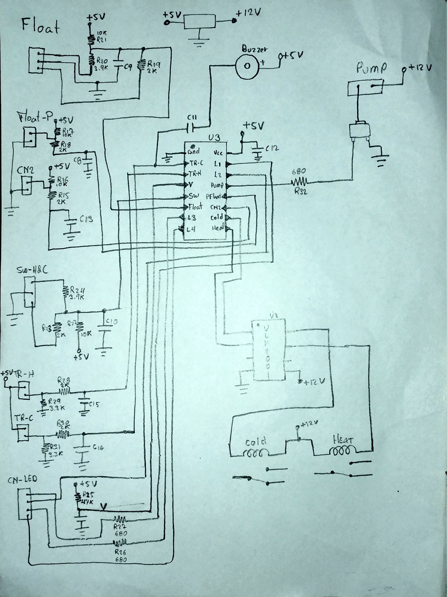
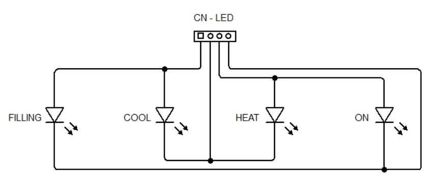

# Auto Filled Water Cooler - Reverse Engineering

This project's main target is to drive a damaged Water Cooling Machine with Auto Water Filling feature to a working stage.

The original mainBoard has hardly gettable damaged devices, including an broken programmable chip.

## **Get the Schematic**

The process started trying o get a real schematic of the board PCB. This step is very important becouse it will let us to understand the circuit and will tell us how to insert the new microcontroller to replace the old one.

Avoiding the AC line rectification module, and taking several meassures, schematic is as follows:

_*The name given to the ports was taken from the real designation on the real board.*_

In the image, the job is the replacement of the U3 device, which represents the programmable damaged part.

The U2 device is an ULN2001 driver that uses U3 signals to control the state of the Heat and Cool relays.

## **Inputs**

As seen on the schematic, the controller gets several input signals

1. **FLOAT:** wather tank level (ADC)
    - Empty = 1.4V  (ADC = 290)
    - Mid = 0V (ADC = 171)
    - Full 0.8V (ADC = 171)
2. **FLOAT-P:** water overfilling detection
    - Normal = 5V
    - Overfilled = 0V
3. **CN2:** lower room door state
    - Opened = 5V
    - Closed = 0V
4. **SW-H&C:** Heater and Cooler On/Off switches (ADC)
    - None = 5V (ADC = 1023)
    - Heat = (ADC = 296)
    - Cool = (ADC = 173)
    - Heat & Cool = (ADC = 121)
5. **TR-H:** current heat temperature (ADC)
    - Normal = (ADC = 296)
    - Heat = (ADC = )
6. **TR-C:** current cooling temperature (ADC)
    - Normal = (ADC = 277)
    - Cool = (ADC = )

## **Outputs**

1.  **CN-LED** (L1, L2, L3, L4): outputs for led indicators that uses combinations to turn on a specific led. The specific led schematic is as follows:

    

    _*Each led needs one output for the VCC and the GND on another, so each led on means two outputs setting.*_

    -   **ON:** indicates device is on
        -   VCC = L1
        -   GND = L2
    -   **FILLING:** indicates pump is on
        -   VCC = L3
        -   GND = L2
    -   **HEAT:** indicates heater is on
        -   VCC =
        -   GND =
    -   **COOL:** indicates the cooler is on
        -   VCC =
        -   GND =

2.  **PUMP:** turns On/Off the water pump
    -   On =
    -   Off =
3.  **HEAT:** turns On/Off the water heater
    -   On =
    -   Off =
4.  **COOL:** turns On/Off the water cooler
    -   On =
    -   Off =
